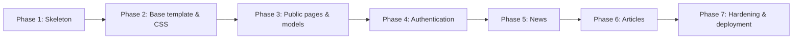

I have a Django project at /home/brouk/workspace/web/ with this structure:

    workspace/web/         ← Poetry project root
    └── web/               ← Django project root (manage.py lives here)
        ├── mysite/        ← Django settings & root URLconf
        ├── info/          ← existing reference app
        └── db.sqlite3

The Django project is named `mysite`. It uses:
- Django 5.2+
- Python 3.12
- Poetry for dependency management
- SQLite as the database
- Environment variables for config (DJANGO_DEBUG, DJANGO_SECRET_KEY, ALLOWED_HOSTS)

There is a detailed implementation plan at:
/home/brouk/.gemini/antigravity/brain/a317986c-f194-42e1-994d-908c24ed9efd/climbing_club_plan.md

Please read this plan FIRST before doing anything.

Your task is to implement the `houski` Django app PHASE BY PHASE:

RULES:
1. Implement ONE phase at a time. Stop after each phase and verify it works.
2. After each phase: run the Django dev server, run the tests, and show me the result before moving to the next phase.
3. If something breaks, fix it before continuing.
4. Ask me before starting the next phase — I may want to review or adjust.
5. Write unit tests for every phase as described in the plan.
6. Never skip verification steps.

Start with Phase 1 (App Skeleton). Tell me exactly what you will create, then create it.


-------------------------------------------------------------

# Climbing Club Django App — Implementation Plan

## Overview

A new Django app (`houski`) will be created **inside the existing `web` Django project**. The app will serve as the public and members-only web presence of a climbing club. It will be hosted on PythonAnywhere and built incrementally so you can understand each piece as it is added.

The existing project structure that matters:

```
workspace/web/         ← Poetry project root
└── web/               ← Django project root (manage.py here)
    ├── mysite/        ← Django settings & root URLconf
    └── info/          ← existing app (reference for conventions)
```

The new app will live at `web/houski/` and follow the same conventions as `info/`.

---

## Guiding Principles

- **One phase at a time.** Each phase is self-contained and testable before moving on.
- **Design is decoupled from logic.** HTML structure and CSS are in separate files. You can completely restyle the app without touching any Python.
- **Django built-ins first.** Use Django's authentication, admin, ORM, and template engine — no extra frameworks unless truly needed.
- **Test as you go.** Every model and view gets a corresponding test file from day one.

---

## Phase 1 — App Skeleton

**Goal:** Create the `houski` Django app, register it in settings, and wire up a minimal URL so something renders in the browser.

### What gets created

| File | Purpose |
|---|---|
| `web/houski/__init__.py` | Makes `houski` a Python package |
| `web/houski/apps.py` | App config (`HouskiConfig`) |
| `web/houski/urls.py` | URL patterns for the `houski` app |
| `web/houski/views.py` | First placeholder view |
| `web/houski/templates/houski/base.html` | Shared base template (header + footer) |
| `web/houski/templates/houski/home.html` | Home page extending base |
| `web/houski/static/houski/css/style.css` | Single CSS file for the whole app |
| `web/houski/tests/` | Test package (empty `__init__.py` + first test file) |

### Settings change

`houski` is added to `INSTALLED_APPS` in `mysite/settings.py`.

### URL change

In `mysite/urls.py`, add:
```python
path("houski/", include("houski.urls")),
```
(or mount at `""` if this becomes the main app of the site)

### What you learn
- How Django discovers apps and templates
- How `include()` splits URL routing across apps
- The `APP_DIRS = True` template loader convention

---

## Phase 2 — Base Template & Design System

**Goal:** Build the shared HTML skeleton that every page inherits from. Establish the visual style — including full mobile responsiveness — before writing any real content.

### `base.html` structure

```
<html>
  <head>  ← meta, title block, CSS link
  <body>
    <header>   ← site name, nav links, login/logout button
    <main>     ← 
    <footer>   ← copyright, useful links
```

### CSS design system (`style.css`)

All colours are defined once as CSS custom properties (variables) at the top:

```css
:root {
  --color-bg:       #0d0d0d;   /* near-black background */
  --color-surface:  #1a1a1a;   /* cards, panels */
  --color-border:   #2e2e2e;   /* subtle borders */
  --color-text:     #e0e0e0;   /* main text */
  --color-muted:    #888888;   /* secondary text */
  --color-accent:   #f0c040;   /* yellow highlight */
  --color-accent-h: #ffd966;   /* hover state of yellow */
}
```

Because variables are in one place, changing the colour scheme later requires editing **only these lines**.

### Header navigation links

| Link | Visible to |
|---|---|
| Home | Everyone |
| About / History | Everyone |
| News | Logged-in members |
| Articles | Logged-in members |
| Login / Logout | Toggles based on `request.user.is_authenticated` |

### Mobile responsiveness

The app must work well on phones. This is handled entirely in CSS — no JavaScript needed.

| Technique | What it does |
|---|---|
| `<meta name="viewport">` tag in `base.html` | Tells the phone browser not to zoom out — the single most important line for mobile |
| CSS Flexbox / Grid for layout | Navigation and content reflow naturally from side-by-side (desktop) to stacked (mobile) |
| `@media (max-width: 768px)` breakpoints | Adjust font sizes, padding, and layout at phone width |
| Touch-friendly tap targets | Buttons and links are at least 44×44 px — comfortable to tap with a finger |
| Images `max-width: 100%` | Uploaded photos never overflow a small screen |

Because design is decoupled from logic, all of this is in `style.css` only. No Django code changes are needed to make pages mobile-friendly.

### What you learn
- Django template inheritance (``, ``)
- How to serve static files (``, ``)
- CSS custom properties (variables) — the key to easy restyling
- CSS Flexbox/Grid and media queries for responsive layouts
- Conditionals in templates (``)

---

## Phase 3 — Public Pages & Data Models

**Goal:** Build the publicly visible sections — Home, About, History — backed by database models editable through the Django Admin.

### Models

#### `ClubInfo` (single-row table — site-wide settings)

| Field | Type | Notes |
|---|---|---|
| `name` | `CharField` | Club name |
| `founded_year` | `IntegerField` | |
| `description` | `TextField` | Short blurb for the home page |
| `history` | `TextField` | Full history text |
| `email` | `EmailField` | Contact email |
| `location` | `CharField` | City / crag area |

Only one row should ever exist. A `save()` override enforces this.

#### `Member`

| Field | Type | Notes |
|---|---|---|
| `user` | `OneToOneField(User)` | Links to Django's built-in `User` |
| `display_name` | `CharField` | Name shown publicly |
| `bio` | `TextField(blank=True)` | Optional short bio |
| `joined_year` | `IntegerField` | |
| `is_active_member` | `BooleanField` | Can be hidden without deleting |
| `photo` | `ImageField(blank=True)` | Optional profile picture |

### Views

| URL | View | Template |
|---|---|---|
| `/houski/` | `HomeView` | `houski/home.html` |
| `/houski/about/` | `AboutView` | `houski/about.html` |
| `/houski/history/` | `HistoryView` | `houski/history.html` |
| `/houski/members/` | `MembersView` | `houski/members.html` |

All above views are **public** (no login required).

### Admin

Register `ClubInfo` and `Member` in `club/admin.py`. Members section links `User` and `Member` via an inline.

### What you learn
- Writing Django models and running `makemigrations` / `migrate`
- `OneToOneField` and how to extend Django's built-in `User`
- Class-based views (`ListView`, `DetailView`, `TemplateView`)
- Registering models in the Admin and using `list_display`, `search_fields`

---

## Phase 4 — Authentication

**Goal:** Add login and logout. Protect the News and Articles sections so only logged-in members can see them.

### Approach

Use Django's **built-in authentication views** (`LoginView`, `LogoutView`). No custom auth code is needed.

### URL additions

```python
path("accounts/", include("django.contrib.auth.urls")),
```

This gives you `/accounts/login/`, `/accounts/logout/`, and password change/reset URLs for free.

### Templates needed

| Template | Notes |
|---|---|
| `registration/login.html` | Login form; styled with the club CSS |

### Protecting views

Any view that should require login uses the `@login_required` decorator (function views) or `LoginRequiredMixin` (class-based views). Unauthenticated users are redirected to the login page automatically.

### Settings additions

```python
LOGIN_URL = "/accounts/login/"
LOGIN_REDIRECT_URL = "/club/"
LOGOUT_REDIRECT_URL = "/club/"
```

### What you learn
- Django's built-in auth system and URL include
- `LoginRequiredMixin` / `@login_required`
- `LOGIN_REDIRECT_URL` and `LOGOUT_REDIRECT_URL` settings

---

## Phase 5 — News Section

**Goal:** Members can read news posts (login required). Posts are created/managed via the Admin.

### Models

#### `NewsPost`

| Field | Type | Notes |
|---|---|---|
| `author` | `ForeignKey(User)` | Who wrote it |
| `title` | `CharField(max_length=200)` | |
| `body` | `TextField(max_length=20248)` | Main text; links allowed as plain URLs |
| `created_at` | `DateTimeField(auto_now_add=True)` | |
| `updated_at` | `DateTimeField(auto_now=True)` | |
| `is_published` | `BooleanField(default=False)` | Draft / published toggle |

#### `NewsImage`

| Field | Type | Notes |
|---|---|---|
| `post` | `ForeignKey(NewsPost)` | Parent post |
| `image` | `ImageField` | Up to 5 per post |
| `caption` | `CharField(blank=True)` | |
| `order` | `PositiveSmallIntegerField` | Display order |

A `clean()` method on `NewsPost` (or a custom Admin form) enforces the 5-image limit.

> **Note on links in body text:** The `body` field stores plain text. A custom Django **template filter** (`|urlize`) automatically converts plain URLs into clickable `<a>` tags when rendering — no rich-text editor needed.

### Views

| URL | View | Template | Access |
|---|---|---|---|
| `/houski/news/` | `NewsListView` | `houski/news_list.html` | Login required |
| `/houski/news/<int:pk>/` | `NewsDetailView` | `houski/news_detail.html` | Login required |

### Admin

`NewsImageInline` (up to 5 images) displayed inside `NewsPostAdmin`.

### What you learn
- `ForeignKey` relationships and reverse lookups
- Django's `ImageField` and how to configure `MEDIA_ROOT` / `MEDIA_URL`
- Template filters (`|urlize`, `|linebreaksbr`)
- Admin inlines (`TabularInline`)

> **Pillow** (Python image library) must be added to dependencies: `poetry add Pillow`

---

## Phase 6 — Articles Section

**Goal:** A more formal articles section — longer content, images, and embedded videos. Login required.

### Models

#### `Article`

| Field | Type | Notes |
|---|---|---|
| `author` | `ForeignKey(User)` | |
| `title` | `CharField(max_length=300)` | |
| `slug` | `SlugField(unique=True)` | Clean URL: `/club/articles/my-great-climb/` |
| `body` | `TextField` | Full article text |
| `summary` | `TextField(max_length=500)` | Shown on list page |
| `created_at` | `DateTimeField(auto_now_add=True)` | |
| `updated_at` | `DateTimeField(auto_now=True)` | |
| `is_published` | `BooleanField(default=False)` | |

#### `ArticleMedia`

| Field | Type | Notes |
|---|---|---|
| `article` | `ForeignKey(Article)` | Parent article |
| `media_type` | `CharField(choices=["image","video"])` | |
| `file` | `FileField` | Uploaded file |
| `caption` | `CharField(blank=True)` | |
| `order` | `PositiveSmallIntegerField` | Display order |

File size is validated in the model's `clean()` method (e.g. images ≤ 10 MB, videos ≤ 200 MB).

### Views

| URL | View | Template | Access |
|---|---|---|---|
| `/houski/articles/` | `ArticleListView` | `houski/article_list.html` | Login required |
| `/houski/articles/<slug>/` | `ArticleDetailView` | `houski/article_detail.html` | Login required |

### What you learn
- `SlugField` and the `slugify()` utility
- `FileField` vs `ImageField`
- Model-level validation with `clean()` and `ValidationError`
- URL kwargs with `<slug:slug>`

---

## Phase 7 — Media Files, Security Hardening, and Production Readiness

**Goal:** Make the app safe to deploy publicly on PythonAnywhere.

### Media files configuration

```python
# settings.py
MEDIA_URL = "/media/"
MEDIA_ROOT = BASE_DIR / "media"
```

Images uploaded via the Admin are stored in `MEDIA_ROOT`. On PythonAnywhere, static and media files are served via the web server config (not Django itself).

### Security checklist

| Setting | Local | Production |
|---|---|---|
| `DEBUG` | `True` | `False` (via `DJANGO_DEBUG=0`) |
| `SECRET_KEY` | insecure placeholder | Strong random key in env var |
| `ALLOWED_HOSTS` | `localhost` | Your PythonAnywhere domain |
| `CSRF` | Enabled (default) | Keep enabled |
| Uploaded files | Stored in `media/` | Outside web root or served read-only |
| Admin URL | `/admin/` (currently commented out) | Re-enable with HTTPS |

### Additional `settings.py` additions for production

```python
SECURE_BROWSER_XSS_FILTER = True
X_FRAME_OPTIONS = "DENY"
SECURE_CONTENT_TYPE_NOSNIFF = True
```

### What you learn
- Django's deployment checklist (`python manage.py check --deploy`)
- Serving media files on PythonAnywhere
- Environment variable-driven configuration (already in place)

---

## Testing Strategy

Tests live in `web/club/tests/` as a package. Each phase adds tests for the code written in that phase.

| Test file | What it covers |
|---|---|
| `test_models.py` | Model field limits, `clean()` validators, single-row enforcement for `ClubInfo` |
| `test_views_public.py` | Public pages return HTTP 200; logged-out users get redirected from protected pages |
| `test_views_auth.py` | Logged-in members can access News and Articles |
| `test_news.py` | 5-image limit, body length limit, `urlize` filter output |
| `test_articles.py` | Slug uniqueness, file size validation |

**Run tests:**
```bash
cd web
python manage.py test houski
```

**Run with verbosity to see individual test names:**
```bash
python manage.py test houski --verbosity=2
```

---

## Recommended Build Order



Each phase ends with a working, testable app. You never have a broken codebase between phases.
